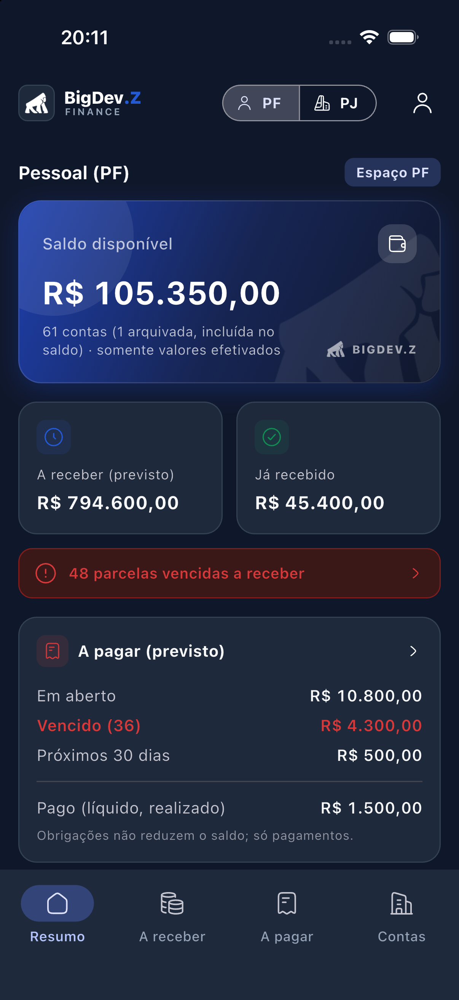
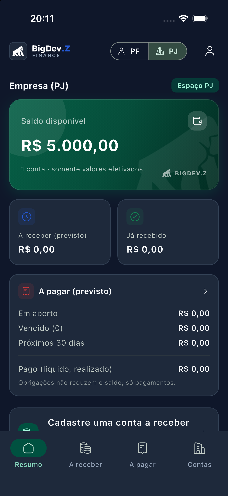
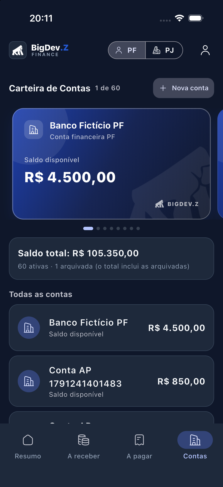
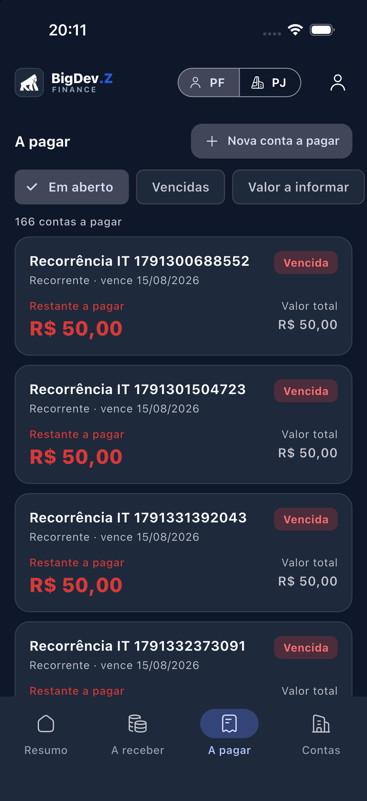
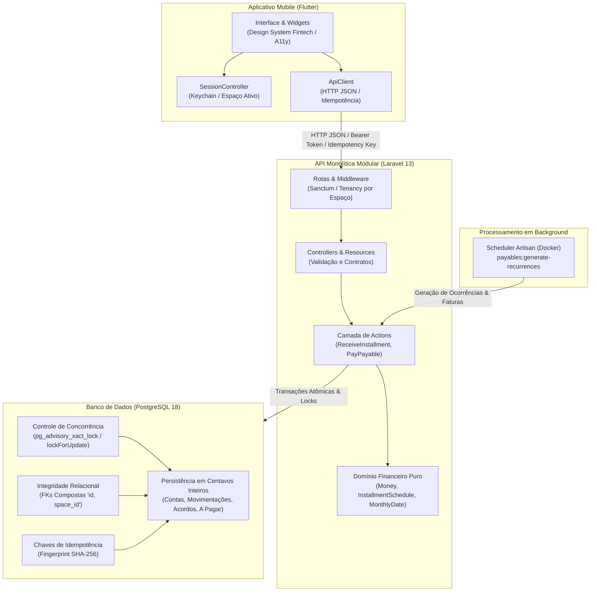

<p align="center">
  <picture>
    <source media="(prefers-color-scheme: dark)" srcset="apps/mobile/assets/brand/gorilla_white.png">
    
  </picture>
</p>

<h1 align="center" style="margin-top: 4px; margin-bottom: 2px; font-weight: 800; letter-spacing: -0.5px;">
  BigDev<span style="color: #2459D4;">.Z</span>
</h1>

<p align="center" style="margin-top: 0; margin-bottom: 20px; font-size: 13px; font-weight: 700; letter-spacing: 3px; color: #64748B;">
  FINANCE
</p>

<h3 align="center">Controle Financeiro Pessoal e Empresarial com Rigor Contábil</h3>

<p align="center">
  Aplicativo financeiro multiplataforma desenvolvido em Flutter, Laravel e PostgreSQL. Projetado com isolamento estrito entre Pessoa Física e Jurídica, precisão monetária sem ponto flutuante, concorrência transacional no banco de dados e interface fintech acessível.
</p>

<p align="center">
  <a href="https://flutter.dev"></a>
  <a href="https://laravel.com"></a>
  <a href="https://www.postgresql.org"></a>
  <a href="https://github.com/jeannlucas/bigdevz-finance/actions"></a>
  <a href="LICENSE"></a>
</p>

---

## Demonstração Visual

Abaixo estão capturas reais do aplicativo executado no Simulador iOS, demonstrando o design system fintech aprovado, temas claro e escuro, cartões específicos para cada espaço e o módulo de contas a pagar.

<table align="center">
  <tr>
    <td align="center" width="50%">
      
      <br /><strong>Resumo — Pessoa Física</strong><br />Saldo disponível e métricas de despesas/receitas
    </td>
    <td align="center" width="50%">
      
      <br /><strong>Resumo — Pessoa Jurídica</strong><br />Isolamento visual completo e dados empresariais
    </td>
  </tr>
  <tr>
    <td align="center" width="50%">
      
      <br /><strong>Carteira de Contas — PF</strong><br />Contas ativas, saldo inicial e cartão azul profundo (#1E40AF / #172554)
    </td>
    <td align="center" width="50%">
      
      <br /><strong>Contas a Pagar — PF</strong><br />Obrigações avulsas, parceladas e recorrentes
    </td>
  </tr>
</table>

> 📸 **Galeria Completa**: Veja todas as 15 capturas oficiais (temas claro e escuro, cartões azul profundo de PF e verde esmeralda de PJ, além da validação de acessibilidade em 150% e 200%) em [docs/screenshots.md](docs/screenshots.md).

---

## Destaques de Engenharia e Regras Financeiras

- **Isolamento Absoluto PF / PJ**: Cada recurso pertence obrigatoriamente a um `space_id`. O PostgreSQL reforça essa integridade com chaves estrangeiras compostas `(id, space_id)`, impedindo que transações vinculem contas ou acordos de espaços diferentes. No aplicativo, a árvore de interface é recriada via `KeyedSubtree` ao trocar de espaço, eliminando vazamento de estado em memória. A identidade visual diferencia claramente Pessoa Física (Azul Profundo `#2459D4`) e Pessoa Jurídica (Verde Esmeralda `#137A63`).
- **Precisão Monetária Sem Ponto Flutuante**: Valores monetários são manipulados exclusivamente como centavos inteiros (`bigint`) via objeto de valor `Money` no backend e `money.dart` no app. Cálculos de parcelamento usam distribuição determinística de centavos residuais.
- **Concorrência Protegida no Banco**: Atualizações concorrentes de saldo e movimentações utilizam `pg_advisory_xact_lock` no PostgreSQL em conjunto com transações seriais, mitigando condições de corrida comprovadas por testes automatizados com processos paralelos.
- **Idempotência de Ponta a Ponta**: Operações de mutação exigem chave de idempotência com fingerprint SHA-256 da requisição. Decisões confirmadas e conflitos (HTTP 409) são persistidos, protegendo o usuário contra repetições indevidas causadas por instabilidades de rede.
- **Rastreabilidade e Estornos Contábeis**: Operações financeiras consolidadas não são excluídas do banco. Correções e estornos geram lançamentos compensatórios em espelho (`reversal`), preservando a auditoria histórica completa.
- **Acessibilidade e Layouts Adaptativos**: Rótulos com apresentação multilinhas adaptativa para fontes ampliadas em 150% e 200%, formulários com rolagem responsiva ao abrir o teclado virtual e preservação rigorosa da Safe Area em todas as telas.
- **Pirâmide de Testes Completa**: Testes de domínio desacoplados do framework, suíte de API executada em PostgreSQL real (com cenários de concorrência e idempotência) e suíte móvel com validação de widgets e fluxos de tela.

---

## Arquitetura

O sistema adota o padrão de monólito modular na API e organização por funcionalidades (*features*) no aplicativo móvel:



Para detalhes adicionais de decisões técnicas e fluxo de dados, consulte [docs/architecture.md](docs/architecture.md).

---

## Estrutura do Repositório

```text
├── apps/
│   ├── api/                  # API Laravel (PHP 8.3, PostgreSQL 18)
│   │   ├── app/Actions/      # Casos de uso atômicos (Recebimentos, Pagamentos, Contas)
│   │   ├── app/Domain/       # Regras puras sem framework (Money, Cronogramas, Datas)
│   │   ├── app/Http/         # Controllers, Form Requests e Resources
│   │   ├── app/Models/       # Modelos Eloquent com restrições relacionais
│   │   ├── database/         # Migrations estruturais e seeders de teste
│   │   └── tests/            # Testes de domínio, integração e concorrência
│   └── mobile/               # Aplicativo móvel (Flutter 3.47.6)
│       ├── lib/core/         # ApiClient, Money, datas e armazenamento seguro
│       ├── lib/features/     # Módulos: auth, summary, accounts, agreements, payables
│       ├── lib/ui/           # Design system, tokens, temas e widgets acessíveis
│       ├── test/             # Testes de unidade e widgets
│       └── integration_test/ # Testes de integração no dispositivo/simulador
├── design/                   # Assets e referências visuais da marca
├── docs/                     # Documentação técnica, arquitetura, ADRs e guias
├── prints/                   # Catálogo canônico oficial de evidências visuais (15 telas)
├── docker-compose.yml        # Orquestração do PostgreSQL e API para desenvolvimento
└── Makefile                  # Comandos operacionais para build, migração e testes
```

---

## Requisitos do Ambiente

- **PHP**: 8.3 ou superior (64 bits) com extensão `pdo_pgsql` e Composer 2.
- **Docker & Docker Compose**: Para execução do PostgreSQL 18 e da API em desenvolvimento.
- **Flutter**: 3.47.6 stable.
- **iOS**: macOS com Xcode para compilação e execução no simulador ou dispositivo físico.
- **Android**: Android SDK (compileSdk 36, NDK 28.2) para compilação no emulador ou dispositivo físico.

---

## Guia de Execução Rápida

### 1. Inicializar os Serviços da API

O projeto inclui um `Makefile` configurado para automatizar todo o ciclo local:

```bash
# Iniciar PostgreSQL 18 e API no Docker (http://127.0.0.1:8000)
make up

# Aplicar migrations estruturais no banco de desenvolvimento
make migrate

# Popular usuário e dados fictícios de desenvolvimento (recusado em produção)
make seed

# Executar roteiro HTTP de verificação rápida
make smoke-api
```

> **Credenciais de Desenvolvimento Local**:
> `demo@example.com` / `demo-bigdevz-local` (criadas exclusivamente pelo seeder de teste).

### 2. Executar a Suíte de Testes Automatizados

O banco de teste isolado `bigdevz_finance_test` sobe automaticamente via `make up`:

```bash
# Testes do núcleo de domínio PHP (sem framework)
make test-domain

# Suíte completa da API no PostgreSQL real (inclui concorrência multiprocesso)
make test-api

# Análise de estilo de código PHP (Pint)
make lint-api

# Análise estática e testes unitários do Flutter
make mobile-deps && make analyze-mobile && make test-mobile
```

### 3. Execução no Simulador iOS ou Emulador Android

#### No Simulador iOS:
```bash
# Inicializar o simulador iPhone
xcrun simctl boot "iPhone 17 Pro"

# Compilar e executar o app apontando para a API local
make run-ios DEVICE="iPhone 17 Pro"
```
No macOS, visualize a janela do simulador pelo **Device Hub** (`open -a DeviceHub`).

#### No Emulador Android:
```bash
# Inicializar o emulador Android cadastrado (ex.: bigdevz_api36)
flutter emulators --launch bigdevz_api36

# Compilar e executar o app apontando para a API local (10.0.2.2:8000)
make run-android

# Ou verificar a compilação nativa gerando o APK de depuração
make build-android-debug
```

Para guia passo a passo, permissões nativas, depuração e conectividade via `adb reverse`, consulte o [Guia de Desenvolvimento Multiplataforma](docs/mobile-development.md).

### Endereço da API por Ambiente (`--dart-define=API_BASE_URL=...`):

| Ambiente de Execução | URL da API | Observação |
| :--- | :--- | :--- |
| **Simulador iOS** | `http://127.0.0.1:8000/api` | Configuração padrão utilizada |
| **Emulador Android** | `http://10.0.2.2:8000/api` | Redirecionamento padrão para o host |
| **Aparelho Físico** | `http://IP-DA-MAQUINA:8000/api` | API iniciada com `BIGDEVZ_API_BIND=0.0.0.0 make up` |

---

## Roteiro de Validação Funcional

Para testar as principais funcionalidades no aplicativo:

1. **Acesso**: Efetue login com o usuário fictício; o espaço **Pessoa Física (PF)** é carregado por padrão.
2. **Nova Conta Financeira**: Acesse **Contas → Nova conta** e cadastre uma conta com saldo inicial (ex.: R$ 1.000,00).
3. **Novo Acordo a Receber**: Em **A receber → Novo acordo**, cadastre "Venda de veículo", R$ 24.000,00 em 12 parcelas. O saldo bancário permanece inalterado (valores previstos não afetam o saldo disponível).
4. **Registrar Recebimento**: Na Parcela 1, registre o recebimento total selecionando a conta de destino. Revise os detalhes antes de confirmar: o saldo disponível é atualizado com exatidão e o acordo atualiza o saldo devedor.
5. **Estorno e Correção**: No menu do recebimento efetivado, realize um **Estorno** informando o motivo: o valor é debitado via movimentação espelho e o histórico preserva a auditoria completa.
6. **Alternância PF/PJ**: Alterne para o espaço **Pessoa Jurídica (PJ)** na barra superior: o estado da tela é recriado e nenhuma informação de PF é compartilhada ou exibida.
7. **Contas a Pagar**: Na aba **A pagar → Nova conta a pagar**, teste o cadastro de despesas avulsas, parceladas ou recorrentes com validação de vencimento determinístico.

---

## Documentação Técnica

- [Diretrizes do Projeto e Regras Financeiras](docs/project-guidelines.md): Regras de negócio, convenções contábeis e padrões de código.
- [Arquitetura do Sistema](docs/architecture.md): Detalhamento dos componentes, camadas e fluxos de dados.
- [Contrato da API](docs/api.md): Especificação dos endpoints REST, recursos e códigos de status.
- [Decisões Arquiteturais (ADRs)](docs/decisions/):
  - [ADR 0001: Estado Inicial](docs/decisions/0001-estado-inicial.md)
  - [ADR 0002: Dinheiro e Parcelas](docs/decisions/0002-dinheiro-e-parcelas.md)
  - [ADR 0003: API, App e Ambiente](docs/decisions/0003-api-app-e-ambiente.md)
  - [ADR 0004: Estorno, Correção e Idempotência](docs/decisions/0004-estorno-e-correcao.md)
  - [ADR 0005: Edição e Arquivamento de Contas](docs/decisions/0005-editar-e-arquivar-contas.md)
  - [ADR 0006: Módulo de Contas a Pagar e Recorrências](docs/decisions/0006-a-pagar.md)
- [Roadmap de Evolução](ROADMAP.md): Etapas concluídas e próximos módulos planejados.
- [Guia de Contribuição](CONTRIBUTING.md): Padrões de branch, mensagens de commit e diretrizes de desenvolvimento.

---

## Licença

Este projeto é distribuído sob os termos da licença **MIT**. Consulte o arquivo [LICENSE](LICENSE) para obter o texto integral e as condições de uso.
