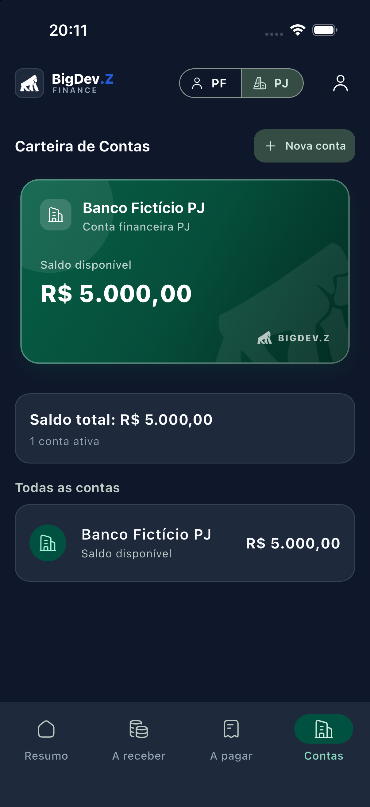
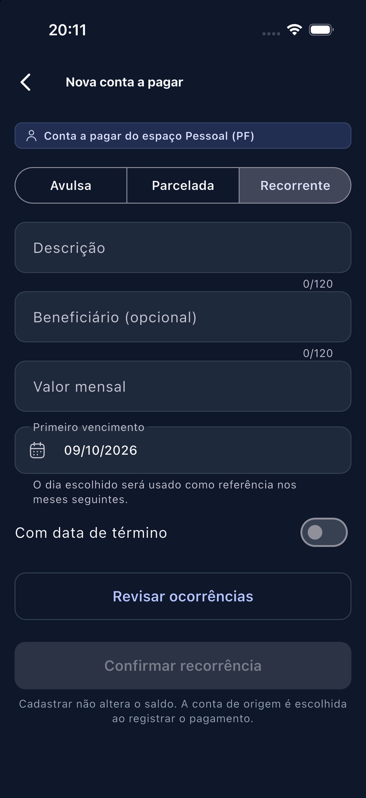
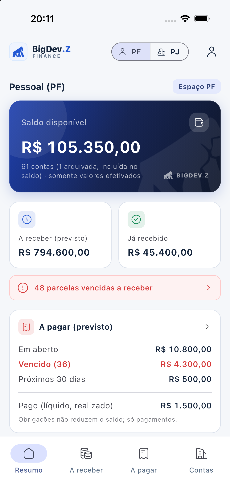
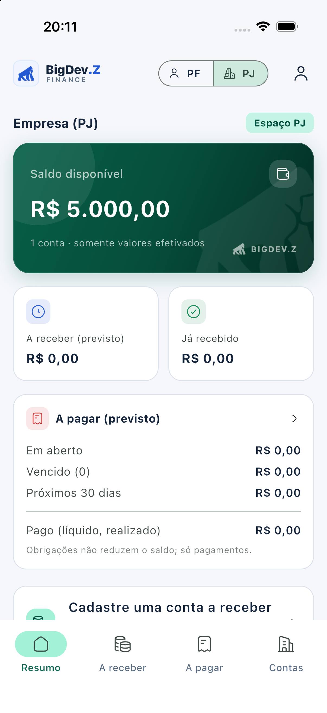
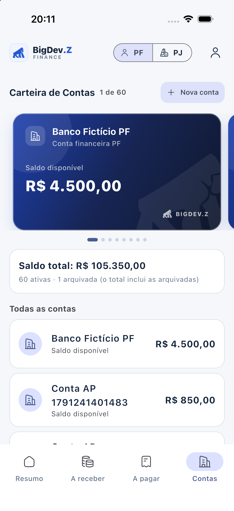
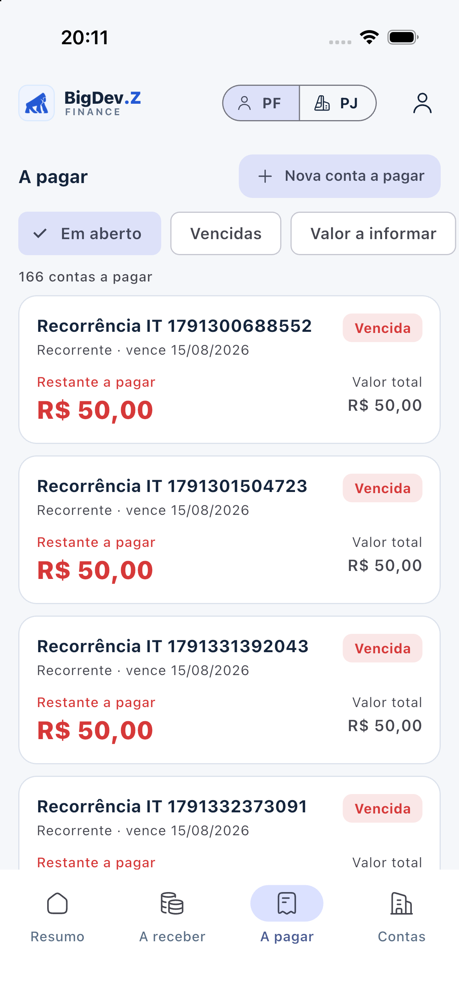
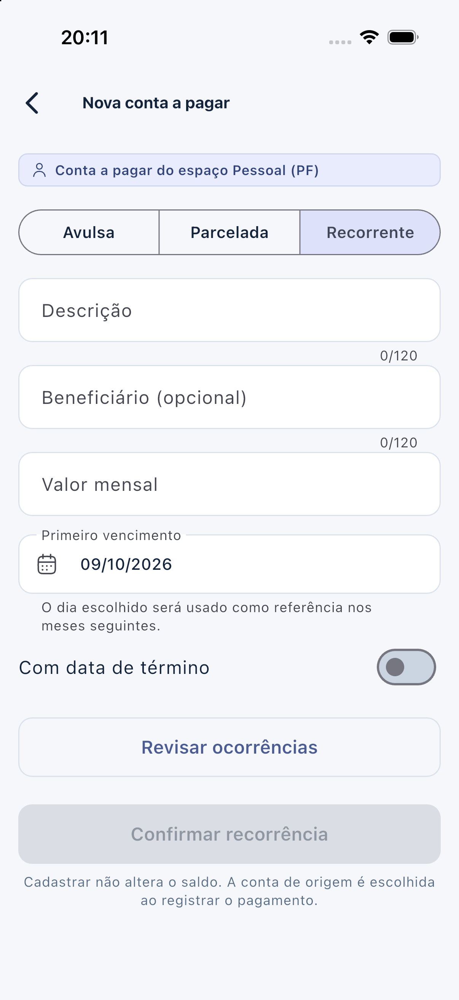
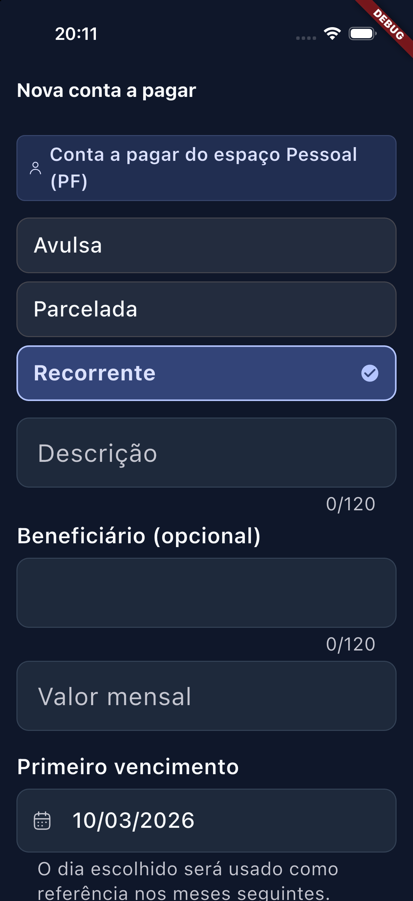
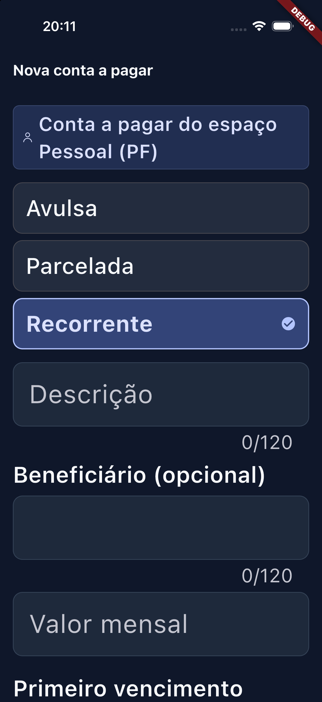

# Galeria Oficial de Evidências Visuais

Catálogo completo das 15 capturas oficiais do **BigDev.Z Finance**, comprovando a interface fintech aprovada, o isolamento estrito entre espaços (Pessoa Física e Pessoa Jurídica), temas claro e escuro, e conformidade com acessibilidade sob texto ampliado (150% e 200%) em telas compactas (375pt).

Todas as capturas foram extraídas diretamente de execuções reais no Simulador iOS e testes automatizados de integração, sem dados reais e sem edição gráfica.

---

## Tema Escuro (Dark Mode)

### Resumo e Carteira

<table align="center">
  <tr>
    <td align="center" width="50%">
      
       <strong>dark_01_resumo_pf.png</strong> Resumo financeiro consolidado — PF
    </td>
    <td align="center" width="50%">
      
       <strong>dark_02_resumo_pj.png</strong> Resumo financeiro com métricas empresariais — PJ
    </td>
  </tr>
  <tr>
    <td align="center" width="50%">
      
       <strong>dark_03_carteira_pf.png</strong> Carteira de contas — PF (Cartão Azul)
    </td>
    <td align="center" width="50%">
      
       <strong>dark_04_carteira_pj.png</strong> Carteira de contas — PJ (Cartão Verde Esmeralda)
    </td>
  </tr>
</table>

### Contas a Pagar

<table align="center">
  <tr>
    <td align="center" width="50%">
      
       <strong>dark_05_a_pagar_pf.png</strong> Aba A Pagar — Lista de obrigações e status
    </td>
    <td align="center" width="50%">
      
       <strong>dark_06_cadastro_pagar_recorrente.png</strong> Cadastro de conta recorrente com seletor adaptativo
    </td>
  </tr>
</table>

---

## Tema Claro (Light Mode)

### Resumo e Carteira

<table align="center">
  <tr>
    <td align="center" width="50%">
      
       <strong>light_01_resumo_pf.png</strong> Resumo financeiro consolidado — PF
    </td>
    <td align="center" width="50%">
      
       <strong>light_02_resumo_pj.png</strong> Resumo financeiro com métricas empresariais — PJ
    </td>
  </tr>
  <tr>
    <td align="center" width="50%">
      
       <strong>light_03_carteira_pf.png</strong> Carteira de contas — PF (Cartão Azul)
    </td>
    <td align="center" width="50%">
      
       <strong>light_04_carteira_pj.png</strong> Carteira de contas — PJ (Cartão Verde Esmeralda)
    </td>
  </tr>
</table>

### Contas a Pagar

<table align="center">
  <tr>
    <td align="center" width="50%">
      
       <strong>light_05_a_pagar_pf.png</strong> Aba A Pagar — Lista de obrigações e status
    </td>
    <td align="center" width="50%">
      
       <strong>light_06_cadastro_pagar_recorrente.png</strong> Cadastro de conta recorrente com seletor adaptativo
    </td>
  </tr>
</table>

---

## Acessibilidade e Texto Ampliado

Validação de responsividade e acessibilidade em dispositivos compactos (largura de 375pt, como iPhone SE / iPhone 12 mini) e tela padrão (402pt), comprovando o comportamento de rótulos multilinhas sem reticências, respeito à Safe Area e ausência de sobreposição.

<table align="center">
  <tr>
    <td align="center" width="33%">
      
       <strong>a11y_375px_scale_150_seletor.png</strong> Viewport 375pt — Texto em 150%
    </td>
    <td align="center" width="33%">
      
       <strong>a11y_375px_scale_200_seletor.png</strong> Viewport 375pt — Texto em 200%
    </td>
    <td align="center" width="33%">
      
       <strong>a11y_iphone17pro_scale_200_seletor.png</strong> iPhone 17 Pro (402pt) — Texto em 200%
    </td>
  </tr>
</table>

---

*Metodologia de captura e especificações técnicas detalhadas em [HANDOFF.md](../HANDOFF.md).*
